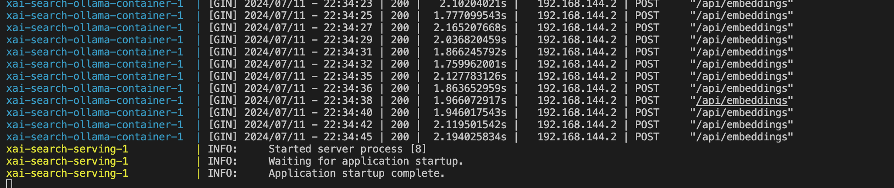

# Project Name

Table of contents
=================

<!--ts-->

- [Project Name](#project-name)
- [Table of contents](#table-of-contents)
- [Introduction](#introduction)
  - [Motivation](#motivation)
- [Installation](#installation)
  - [Setup Environment](#setup-environment)
  - [Install Dependencies and Start Containers](#install-dependencies-and-start-containers)
- [Project Structure](#project-structure)
- [Conclusion](#conclusion)

<!--te-->

# Introduction

## Motivation

# Installation

## Setup Environment

- Clone the repository using Git: `git clone [repository URL]`

- Ensure Docker is installed on your system.

## Install Dependencies and Start Containers

- Run the following command to start the containers: `docker-compose build --no-cache`
- It will prepare the images for the three containers. You will see the following status:
-  
  
   
- Start the image containers by running `docker-compose up`!
Note: The code wont run properly and will break as llama3 model is not present. But we need a live container. 
 
  
   
- Download the LLM model locally. For this project, we are using `llama3`
- Open a new terminal and run the following command to download the `llama3` model:
 `docker exec -it xai-search-ollama-container-1 ollama run llama3`
-  
  
   
- After the download is complete, you may close the terminal.
- Stop the docker containers using `docker-compose down`.
- Restart the image containers by running `docker-compose up`
- **NOTE: It will take some time, as the data is being indexed (first 100 rows of the data).**
-  
  
   
- Wait until you see the logs below: 
-  
  
   
- Open your browser and navigate to the following URL: `http://0.0.0.0:8601/`
-  
  
   

# Project Structure

- `assets` - Contains snapshots captured in this project.
- `data` - Contains the indexed data and the raw data.
- `modules` - Contains the indexing module for the project.
- `ui` - Contains the Streamlit UI app file.
- `main` - Entry point for the backend, contains the search API.
- `constants.py` - As the name suggests, contains all the common variables.

# Conclusion
